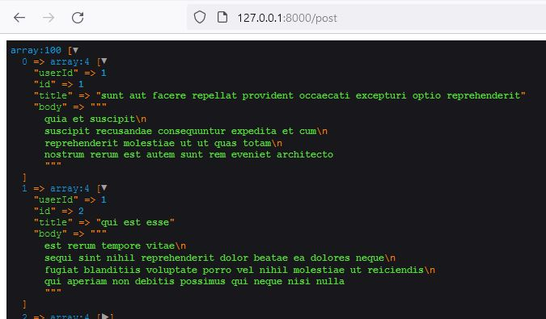
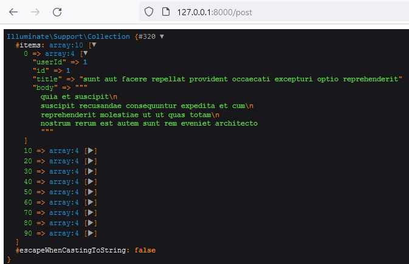

### Main stages of development
https://www.youtube.com/watch?v=OtGrKywzRNI
##### 1. Installation Project Template. Create Database

`composer create-project --prefer-dist  laravel/laravel .`   
`npm install`  
`npm run dev`  

`git init`  
`git add .`  
`git commit –m "Comment"`  
**`git remote add origin https://github.com/SergeyHub/cargo.git`**  
`git push -u origin master`  

##### 1.1 Postgersql

```
Let's start SQL Shell (psql). The program will prompt you to enter the name    
of the server, database, port and user. You can click/skip these items as they  
will use the default values   
(for server - localhost, for database - postgres, for port - 5432,  
as user - postres superuser). 
Next, you will need to enter a password for the user   
(by default, the postgres user): 123456 (in my case)  
```
 

`postgres=# create database cargo;`  
  database list  
`select datname from pg_database;` 
pg_dump dbname > outfile 

**`Edit  env. file`**    
```
DB_CONNECTION=pgsql
DB_HOST=localhost
DB_PORT=5432
DB_DATABASE=cargo
DB_USERNAME=postgres
DB_PASSWORD=123456
```
##### 1.2 MySQL

`mysql -u root -p`  
`create database cargo; db_name;`  
`drop database db_name;`   
`show databases;`  
`use db_name;`  
`show tables;`   
`drop table table_name;`  
`exit`  

**`Edit  env. file`**   
```
DB_CONNECTION=mysql
DB_HOST=127.0.0.1
DB_PORT=3306
DB_DATABASE=cargo
DB_USERNAME=root
DB_PASSWORD=123456
```
##### 1.3 Migration

`php artisan migrate`  
```
Migration table created successfully.
Migrating: 2014_10_12_000000_create_users_table
Migrated:  2014_10_12_000000_create_users_table (88.36ms)
Migrating: 2014_10_12_100000_create_password_resets_table
Migrated:  2014_10_12_100000_create_password_resets_table (6.44ms)
Migrating: 2019_08_19_000000_create_failed_jobs_table
Migrated:  2019_08_19_000000_create_failed_jobs_table (9.15ms)
Migrating: 2019_12_14_000001_create_personal_access_tokens_table
Migrated:  2019_12_14_000001_create_personal_access_tokens_table (10.80ms)
```

##### 2. Edit welcome.blade.php

##### 3. Create PostController and PostController route. Create app.blade & index.blade
`php artisan make:controller PostController`  

 

#### 4. Edit PostController index() use collect 

 

##### 5. Create navbar style & script blade files

https://api.cargo.tech/   
https://api.cargo.tech/v1/cargos   
`php artisan make:controller CollectionController`  

##### 6.1 Rename CollectionController Create layout_reddit/default.blade reddit/index.blade
https://www.youtube.com/watch?v=a2QvlLs0uEk  
`git push -u origin master`

##### 7. Release Filter Method
##### 8. Release Pluck Method

##### 9. Create CargoController

`php artisan make:controller CargoController`  

##### 10. Create Contains Method for RedditController
##### 11. Create groupby Method for RedditController
##### 12. Create sortyby Method for RedditController
##### 13. Create Fruit Wine FruitType & WineType models and migrations  
`php artisan make:model Fruit -m`     
`php artisan make:model FruitType -m`     
`php artisan make:model Wine -m`     
`php artisan make:model WineType -m`   
`php artisan migrate`     
 
----
Laravel 8 app fetching data from url using
schedule | Laravel 8 Project fetching data from url 2021  
  https://www.youtube.com/watch?v=ogGBHwAoFhU  
  https://dev.shepherd.appoly.io/fruit.json  
-----
  
